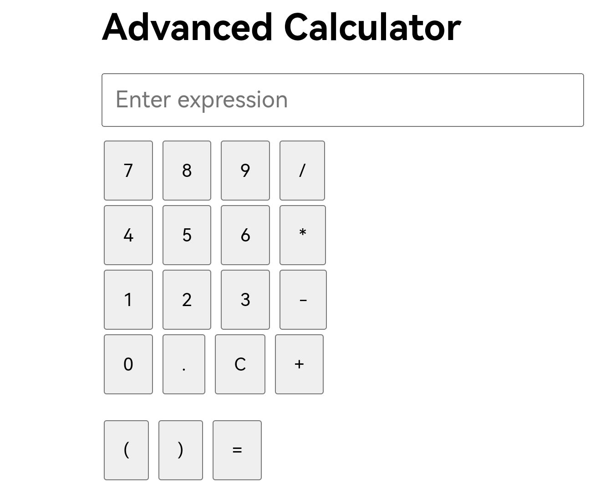

# Advanced Calculator (Web)

Flask web interface for calculator operations.

## Features

- Web-based calculator UI

- Expression evaluation via web form
- Button interface for input
- Real-time calculation results

## Implementation

- Uses Flask for web framework
- Calls `Calculator.evaluate_expression()` for calculations
- Template: `templates/advance_calculator.html`
- Accepts GET and POST requests

## Notes

- Runs on port 5000 by default
- Expression evaluation uses the Calculator class
